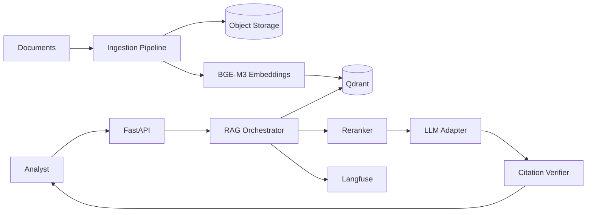
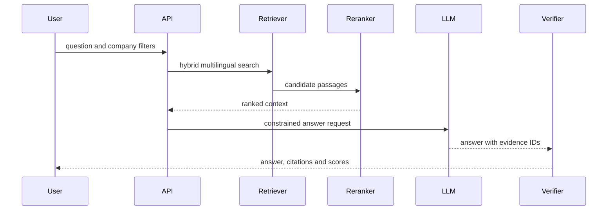

# DualLens AI Intelligence — Architecture Plan

## Product Goal

Provide a multilingual competitive-intelligence workspace that answers questions across company documents and compares AI initiatives with verifiable citations and evaluation scores.

## Technology and Model Strategy

| Concern | Choice |
|---|---|
| API | FastAPI |
| RAG framework | LlamaIndex |
| Vector store | Qdrant |
| Embeddings | BGE-M3 for multilingual retrieval |
| Paid model | `gpt-4.1-mini` |
| Optional reasoning | Configurable reasoning model for cross-company synthesis |
| Local model | Gemma 4 E4B through Ollama |
| Observability | Langfuse retrieval, generation and evaluation spans |

Both providers implement the same structured generation contract. Retrieval and citations remain provider-independent, making paid/local comparisons reproducible.

## HLD

## LLD and Flow

Core modules:

- `ingestion`: parsing, chunking, metadata, deduplication and versioning.
- `retrieval`: dense/sparse search, filtering and reranking.
- `generation`: paid/local adapters and structured cited answers.
- `comparison`: company initiative scoring and evidence-backed ranking.
- `evaluation`: retrieval recall, groundedness and citation correctness.

## Safety and Quality Gates

- Every material claim must reference an ingested evidence identifier.
- Reject answers when available context is insufficient.
- Preserve document ownership, license and effective-date metadata.
- Maintain English, Arabic and code-switched evaluation sets.
- Compare retrieval quality separately from generation quality.

## Delivery Scope

Version 1 supports PDF and HTML ingestion, Qdrant, BGE-M3, OpenAI and Ollama modes, source-linked answers, company comparison and Langfuse evaluations.
